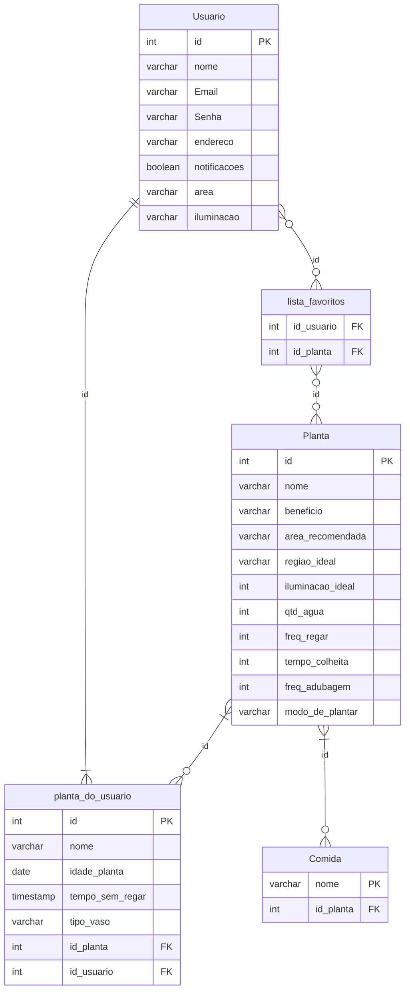

# Plantei Back-end

```mermaid
erDiagram
	Usuario {
		int id PK
		varchar nome
		varchar Email
		varchar Senha
		varchar endereco
		boolean notificacoes
		varchar area
		varchar iluminacao
	}

	Planta {
		int id PK
		varchar nome
		varchar beneficio
		varchar area_recomendada
		varchar regiao_ideal
		int iluminacao_ideal
		int qtd_agua
		int freq_regar
		int tempo_colheita
		int freq_adubagem
		varchar modo_de_plantar
	}

	planta_do_usuario {
		int id PK
		varchar nome
		date idade_planta
		timestamp tempo_sem_regar
		varchar tipo_vaso
		int id_planta FK
		int id_usuario FK
	}

	lista_favoritos {
		int id_usuario FK
		int id_planta FK
	}

	Comida {
		varchar nome PK
		int id_planta FK
	}

	Usuario ||--|{ planta_do_usuario : id
	Usuario }o--o{ lista_favoritos : id
	lista_favoritos }o--o{ Planta : id
	Planta }|--o{ planta_do_usuario : id
	Planta }|--o{ Comida : id
```
